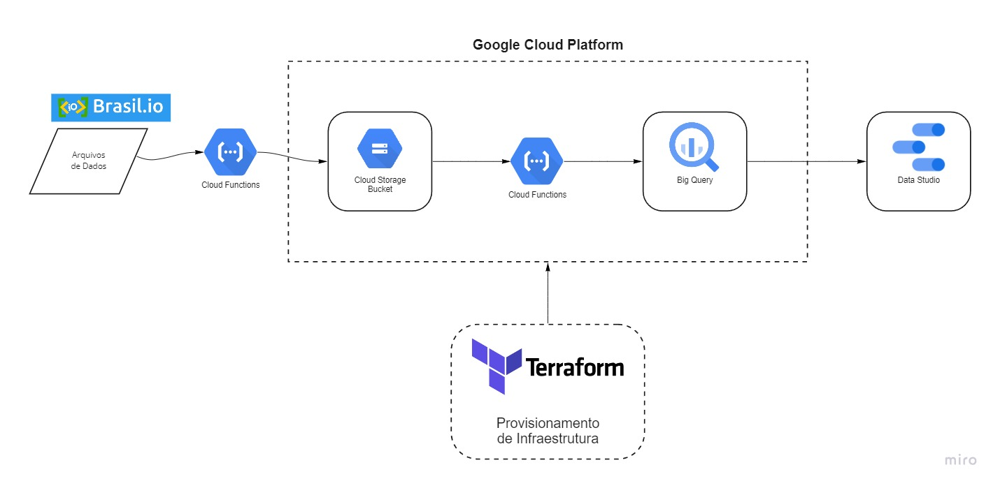

# Estudo de Caso COVID-19

## Os dados utilizados nesse estudo foram obtidos no site Brasil.io 
### [Link para acesso aos dados](https://brasil.io/dataset/covid19/caso_full/),  foram utilizados os arquivos 'caso' e 'obito_cartorio'

## Diagrama da Arquitetura

## Tecnologias
* Google Cloud Platform
    * Google Cloud Functions - Executador de funções serverless
    * Google Cloud Storage - Armazenamento de dados / Data Lake
    * Google BigQuery - Plataforma SQL e Data Warehouse
    * Google Data Studio - Apresentação de Dados / Dashboards
* Terraform - Infrastructure-as-Code (IaC) para manter reprodutibilidade de infraestrutura Cloud
* Python - Linguagem de programação escolhida para scripts em Cloud Function

## Requisitos para replicar projeto
* Conta em Google Cloud Platform (GCP)
* Google Cloud SDK instalado e configurado no computador
* Terraform instalado e configurado no computador

## Cloud Functions e Cloud Storage

### Cloud Storage e BigQuery

O Cloud Storage utilizado nesse estudo de caso possuí o nome de 'upload_covid_data_{nome do projeto em GCP}', é de classe 'Standard'.
O BigQuery utilizado nesse estudo de caso possuí o dataset nomeado 'covid'.
Ambos os recursos foram criados utilizando Terraform, onde o código de provisionamento pode ser encontrado [aqui](/terraform-gcp/main.tf)

Todas as predefinições de nome, id de projeto, região, classe do armazenamento e bucket podem ser alteradas no arquivo de variáveis de execução do Terraform.
Esse arquivo pode ser encontrado [aqui](/terraform-gcp/variables.tf)

### Cloud Functions

O código utilizado nas Cloud Functions está disponível [aqui](/cloud_funtions/src/)

### [upload_files_to_gcs.py](/cloud_funtions/src/upload_files_to_gcs.py)

O código desse arquivo realiza o processo de baixar e enviar os dados disponíveis no Brasil.io para o Cloud Storage Bucket criado com Terraform.
O resultado esperado dessa função é o erro "could not handle request", já que ela opera sendo disparada diretamente em HTTPS autorizado sem necessidade de receber nada no corpo da requisição.

### [stream_data_to_bigquery.py](/cloud_funtions/src/stream_data_to_bigquery.py)

O código desse arquivo realiza o processo de carregar o arquivo adicionado ao Cloud Storage para o BigQuery com instrução de sobre-escrita.
O dataset no BigQuery já terá sido criado via Terraform.
A função irá registrar a tabela criada em BigQuery e a quantidade de linhas atualizadas/sobre-escritas.
O nome das tabelas é predefinido na própria Cloud Function.

## BigQuery

Códigos utilizados e resultados para as questões requisitadas estão disponíveis [neste arquivo](/Estudo%20de%20Caso%20COVID-19%20-%20BigQuery.pdf) 

## Dashboard

O dashboard foi produzido com Google Data Studio utilizando dados disponíveis no BigQuery do projeto.

O link para o dashboard é público e pode ser acessado por este [link](https://datastudio.google.com/reporting/8343a81c-c460-4c63-acda-6f924972c475)

